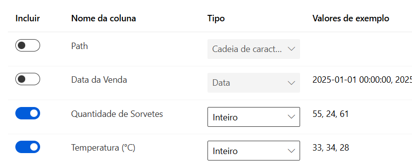
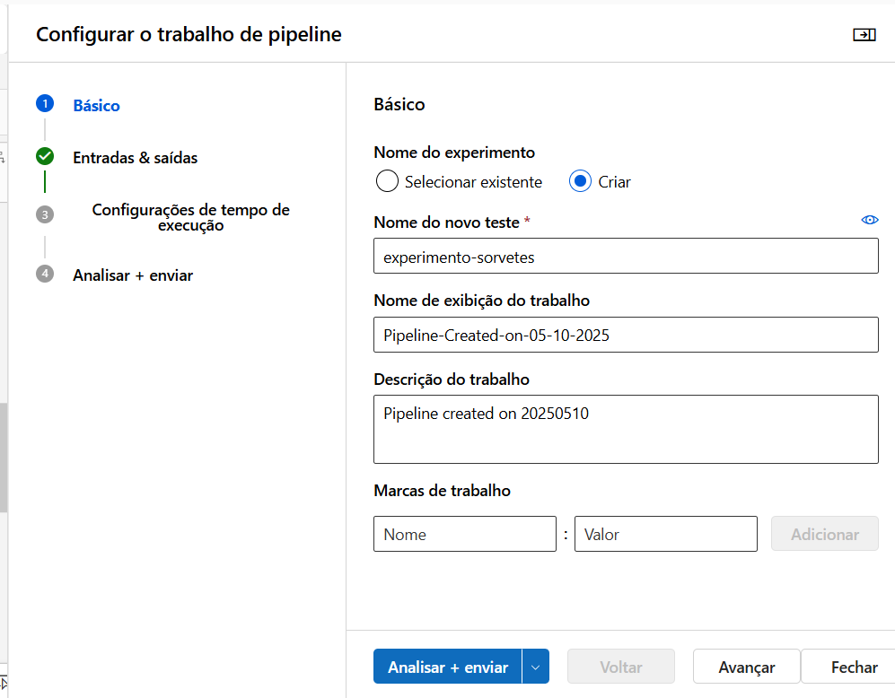

# Modelo de Machine Learning no Azure

#### Criação de um modelo de regressão no Azure Machine Learning para predição das vendas de sorvetes de acordo com a temperatura

## _Base de Dados_

O dataset com 100 registros foi criado de forma aleatória com código Python.

O resultado ficou assim:

## _Criação da subscription, resource group e acesso ao Azure Machine Learning Studio_

Na página inicial do Azure accese o _resource group_ para criar um grupo de recursos, local que armazenara todo o trabalho e arquivos.

Dentro do _resource group_, criamos uma _subscription_, o _resource group_ e escolhemos a região.

Após criado, o _resource group_ fica assim:

Dentro dele, pesquisamos pelo Azure Machine Learning e clicamos em _create_.

Confirmamos a _subscription_, o _resource group_ e a região.

Após criado, o Azure Machine Learning  fica assim:

Clicamos em _Lauch Studio_ para entrar no _Azure Machine Learning Studio_.

## _Escolha da Computação_

Para treinar os dados e criar modelos, é imprescindível criar uma instância de computação que atenda a necessidade do trabalho. Para isso, vamos em _Computação_ e escolhemos uma instância de computação. O Azure oferece várias opções por preços acessíveis, escolha uma que se encaixa nas suas necessidades.

Também é importante escolher um _cluster de computação, que será utilizado na criação do pipeline.

## _Configuração do Jupyter Notebook e o Upload dos arquivos_

No seu computador crie uma pasta com a base de dados em formato _.csv_ e o Jupyter Notebook com o script de treinamento em Python e o arquivo _.json_ com as informações adicionais para a configuração da credential.

Faça o upload da pasta para a seção _Notebooks_ do Azure Machine Learning Studio.

## _Início do Job no ML Automatizado_

Criamos um ativo de dados a partir do upload do mesmo dataset.

O Azure automaticamente armazena os dados no Storage Blog. Recomendo manter essa configuração.

Configuramos quais são as colunas o Azure irá trabalhar. Também é importante confirmar o tipo de dado (inteiro ou decimal) dos valores e é possível alterar. Nesse caso, os dados da Temperatura foram alterados de decimal para inteiro.

Confirmamos se o tipo de dado está como tabular.

Em _ML automatizado_, escolhemos o tipo de tarefa, nesse caso, a Regressão.

Além disso, é possível escolher o algoritmo no qual desejamos que o Azure utilize. Nesse caso, queremos somente o _XGBoostRegressor_.Portanto bloqueamos todos os outros.

Selecionamos a coluna de destino, nesse caso, a _Quantidade de Sorvetes_ é a principal variável que o modelo de regressão vai trabalhar.

Configuramos o número máximo de nós, o tempo limite do experimento e também da iteração.

Escolhemos a instância de computação, nesse caso, o cluster de cálculo. O Azure irá utilizar a instância que foi criada anteriormente. Confirmamos todas as informações e colocamos o experimento para rodar.

Após o experimento ser finalizado, ele aparecerá como concluído.

Clicamos no experimento e podemos ver os modelos e trabalhos-filhos.

É possível ver as métricas de cada modelo, analisá-los e ver qual é o melhor.

Após escolher um modelo, é só implantá-lo.

## _Criação do Pipeline_

Também podemos criar um pipeline do experimento. Para isso vamos na seção _Designer_.

Selecionamos o dataset que foi carregado.

Para montar o pipeline, vamos selecionando os componentes. Aqui foi escolhido o componente _Select Columns in Dataset_.

Em cada componente, vamos configurando os parâmentros. Aqui escolhemos as colunas que possuem os valores que importam para o modelo.

Aqui foi escolhido o componente _Split Data_.

Configuração dos parâmetros: Será treinado apenas 20% do dataset.

Ligamos um componente ao outro.

Configuração dos parâmetros: Coluna selecionada para o treinamento.

Escolhemos a tarefa: Regressão Linear.

Após conectar todos os componentes, o pipeline fica assim:

Finalizamos o pipeline, dando-lhe um nome:

E selecionando a instância de computação:

Pronto! Agora o trabalho de Machine Learning foi criado.